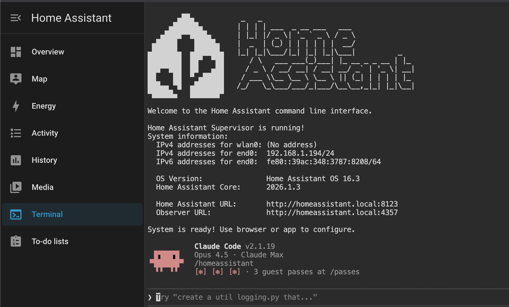

# Home Assistant Add-on: SSH & Claude Code Terminal

[![GitHub Release][releases-shield]][releases]
[![License][license-shield]](LICENSE.md)

![Supports aarch64 Architecture][aarch64-shield]
![Supports amd64 Architecture][amd64-shield]

[![Github Actions][github-actions-shield]][github-actions]

This add-on allows you to log in to your Home Assistant instance using
SSH or Web Terminal, with [Claude Code][claude-code] pre-installed for
AI-assisted Home Assistant configuration.



## About

This add-on allows you to log in to your Home Assistant instance using
SSH or a Web Terminal, giving you access to your folders and
also includes a command-line tool to do things like restart, update,
and check your instance.

This fork includes **Claude Code**, an AI-powered coding assistant that can
help you optimize your Home Assistant configuration, write automations,
and troubleshoot issues directly from the terminal.

Based on the [Advanced SSH & Web Terminal add-on][upstream] by the
Home Assistant Community Add-ons project.

[:books: Read the full add-on documentation][docs]

## WARNING

The advanced SSH & Web Terminal add-on is very powerful and gives you access
to almost all tools and hardware of your system.

While this add-on is created and maintained with care and with security in mind,
in the wrong or inexperienced hands, it could damage your system.

## Features

This add-on, of course, provides an SSH server, based on [OpenSSH][openssh] and
a web-based Terminal (which can be included in your Home Assistant frontend) as
well. Additionally, it comes out of the box with the following:

- Access your command line right from the Home Assistant frontend!
- A secure default configuration of SSH:
  - Only allows login by the configured user, even if more users are created.
  - Only uses known secure ciphers and algorithms.
  - Limits login attempts to hold off brute-force attacks better.
  - Many more security tweaks, _this addon passes all [ssh-audit] checks
    without warnings!_
    ![Result of SSH-Audit][ssh-audit-image]
- Comes with an SSH compatibility mode option to allow older clients to connect.
- Support for Mosh allowing roaming and supports intermittent connectivity.
- SFTP support is disabled by default but is user configurable.
- Compatible if Home Assistant was installed via the generic Linux installer.
- Username is configurable, so `root` is no longer mandatory.
- Persists custom SSH client settings & keys between add-on restarts
- Log levels for allowing you to triage issues easier.
- Hardware access to your audio, uart/serial devices and GPIO pins.
- Runs with more privileges, allowing you to debug and test more situations.
- Has access to the dbus of the host system.
- Has the option to access the Docker instance running on the host system.
- Runs on host level network, allowing you to open ports or run little daemons.
- Have custom Alpine packages installed on start. This allows you to install
  your favorite tools, which will be available every single time you log in.
- Execute custom commands on add-on start so that you can customize the
  shell to your likings.
- [ZSH][zsh] as its default shell. Easier to use for the beginner, more advanced
  for the more experienced user. It even comes preloaded with
  ["Oh My ZSH"][ohmyzsh], with some plugins enabled as well.
- Contains a sensible set of tools right out of the box: curl, Wget, RSync, GIT,
  Nmap, Mosquitto client, MariaDB/MySQL client, Awake ("wake on LAN"), Nano,
  Vim, tmux, and a bunch commonly used networking tools.
- **[Claude Code][claude-code]** pre-installed for AI-assisted Home Assistant
  configuration and automation development.
- **yamllint** included for validating YAML configuration files.

## Installation

This add-on is not part of the official Home Assistant add-on repository.
To install it, you need to add this repository as a custom repository:

1. Open your Home Assistant instance
2. Navigate to **Settings** → **Add-ons** → **Add-on Store**
3. Click the menu (three dots) in the top right corner
4. Select **Repositories**
5. Add the following URL:
   ```
   https://github.com/jantimon/ha-addon-ssh
   ```
6. Click **Add** and then **Close**
7. Refresh the page and find "SSH & Claude Code Terminal" in the add-on store
8. Click **Install**

After installation, configure your username and password/SSH keys, then start
the add-on.

## Using Claude Code

1. Open the terminal (via SSH or Web Terminal in the sidebar)
2. Run `claude` to start Claude Code
3. On first use, run `/login` to authenticate via your browser
4. Start asking questions about your Home Assistant configuration

## Support

Got questions?

You have several options to get them answered:

- The [Home Assistant Community Add-ons Discord chat server][discord] for add-on
  support and feature requests.
- The [Home Assistant Discord chat server][discord-ha] for general Home
  Assistant discussions and questions.
- The Home Assistant [Community Forum][forum].
- Join the [Reddit subreddit][reddit] in [/r/homeassistant][reddit]

You could also [open an issue here][issue] GitHub.

## Contributing

This is an active open-source project. We are always open to people who want to
use the code or contribute to it.

We have set up a separate document containing our
[contribution guidelines](.github/CONTRIBUTING.md).

Thank you for being involved! :heart_eyes:

## Authors & contributors

The original setup of this repository is by [Franck Nijhof][frenck].

For a full list of all authors and contributors,
check [the contributors page][contributors].

## We have got some Home Assistant add-ons for you

Want some more functionality to your Home Assistant instance?

We have created multiple add-ons for Home Assistant. For a full list, check out
our [GitHub Repository][repository].

## License

MIT License

Copyright (c) 2017-2025 Franck Nijhof

Permission is hereby granted, free of charge, to any person obtaining a copy
of this software and associated documentation files (the "Software"), to deal
in the Software without restriction, including without limitation the rights
to use, copy, modify, merge, publish, distribute, sublicense, and/or sell
copies of the Software, and to permit persons to whom the Software is
furnished to do so, subject to the following conditions:

The above copyright notice and this permission notice shall be included in all
copies or substantial portions of the Software.

THE SOFTWARE IS PROVIDED "AS IS", WITHOUT WARRANTY OF ANY KIND, EXPRESS OR
IMPLIED, INCLUDING BUT NOT LIMITED TO THE WARRANTIES OF MERCHANTABILITY,
FITNESS FOR A PARTICULAR PURPOSE AND NONINFRINGEMENT. IN NO EVENT SHALL THE
AUTHORS OR COPYRIGHT HOLDERS BE LIABLE FOR ANY CLAIM, DAMAGES OR OTHER
LIABILITY, WHETHER IN AN ACTION OF CONTRACT, TORT OR OTHERWISE, ARISING FROM,
OUT OF OR IN CONNECTION WITH THE SOFTWARE OR THE USE OR OTHER DEALINGS IN THE
SOFTWARE.

[aarch64-shield]: https://img.shields.io/badge/aarch64-yes-green.svg
[amd64-shield]: https://img.shields.io/badge/amd64-yes-green.svg
[claude-code]: https://claude.ai/code
[contributors]: https://github.com/jantimon/ha-addon-ssh/graphs/contributors
[discord-ha]: https://discord.gg/c5DvZ4e
[docs]: https://github.com/jantimon/ha-addon-ssh/blob/main/ssh/DOCS.md
[forum]: https://community.home-assistant.io/t/community-hass-io-add-on-ssh-web-terminal/33820?u=frenck
[frenck]: https://github.com/frenck
[github-actions-shield]: https://github.com/jantimon/ha-addon-ssh/workflows/CI/badge.svg
[github-actions]: https://github.com/jantimon/ha-addon-ssh/actions
[issue]: https://github.com/jantimon/ha-addon-ssh/issues
[license-shield]: https://img.shields.io/github/license/jantimon/ha-addon-ssh.svg
[ohmyzsh]: http://ohmyz.sh/
[openssh]: https://www.openssh.com/
[reddit]: https://reddit.com/r/homeassistant
[releases-shield]: https://img.shields.io/github/release/jantimon/ha-addon-ssh.svg
[releases]: https://github.com/jantimon/ha-addon-ssh/releases
[semver]: http://semver.org/spec/v2.0.0.htm
[ssh-audit-image]: images/ssh-audit.png
[ssh-audit]: https://github.com/jtesta/ssh-audit
[upstream]: https://github.com/hassio-addons/addon-ssh
[zsh]: https://en.wikipedia.org/wiki/Z_shell
